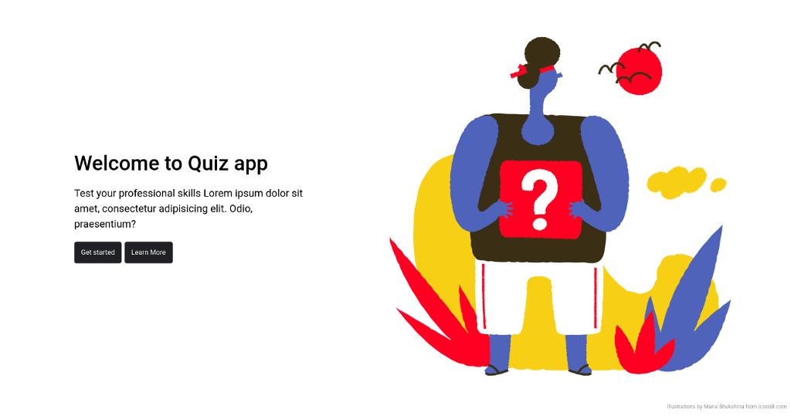
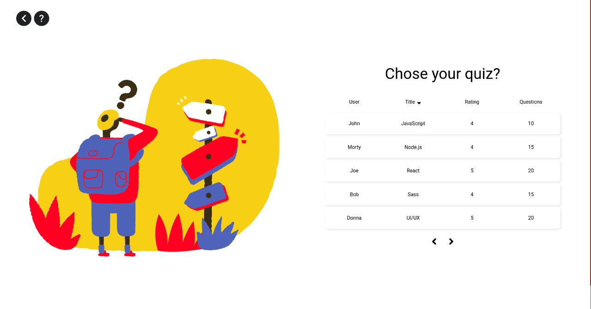

## Quiz

> Single page application

### Demo

  Coming soon :)

#### Screenshots of the app

### Technologies

#### Front end

- React
- Sass
- Axios

### Back end

- Nodejs
- Express
- MongoDB
- JWT

## Getting started

  App requires to have node (4.x.x) and npm (2.x.x) installed.

#### Start with installing the dependencies:

  Run `npm install` to install all required packages.

#### Running:

  Use `npm run start` to start the dev server.

